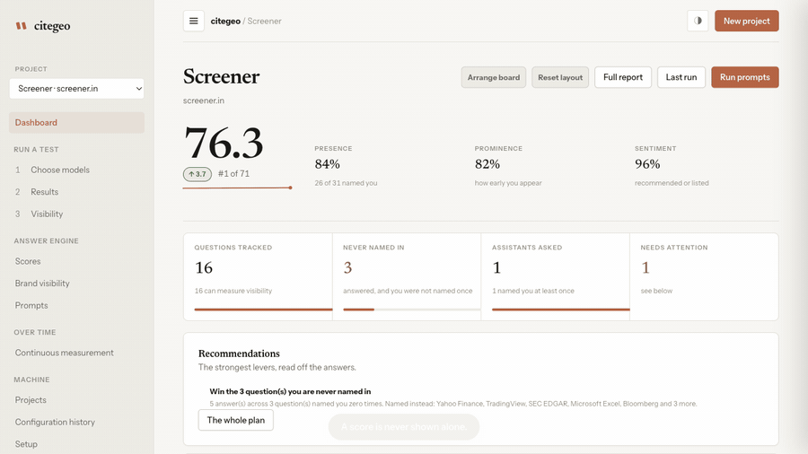
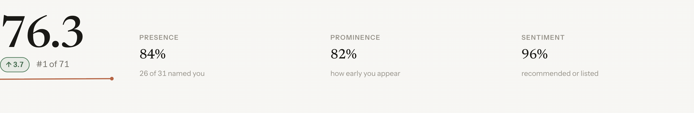
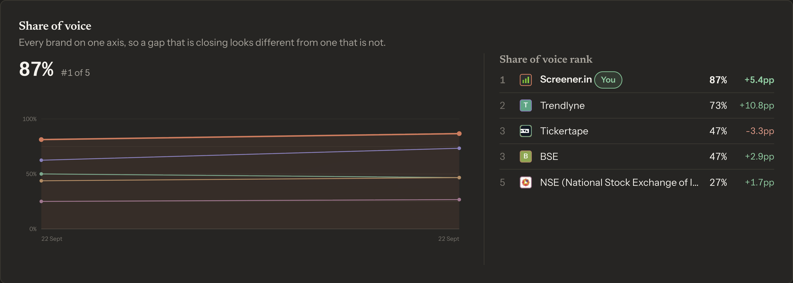
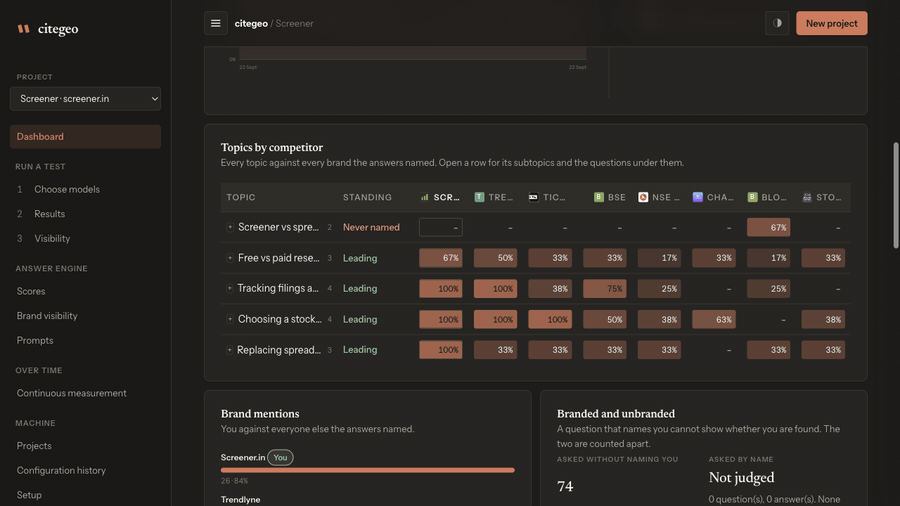
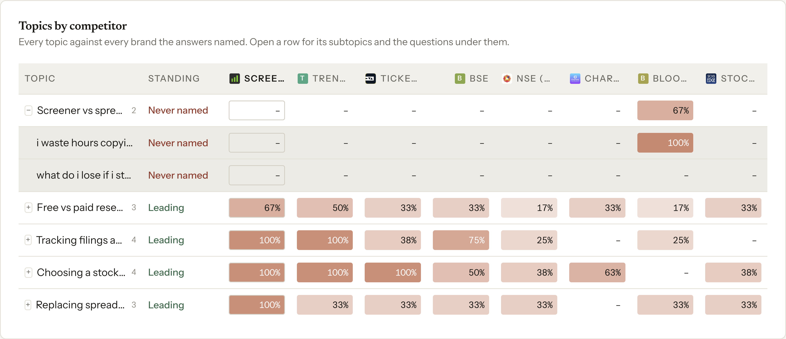
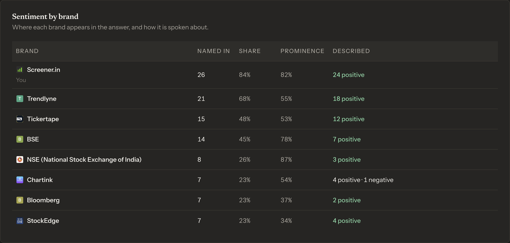
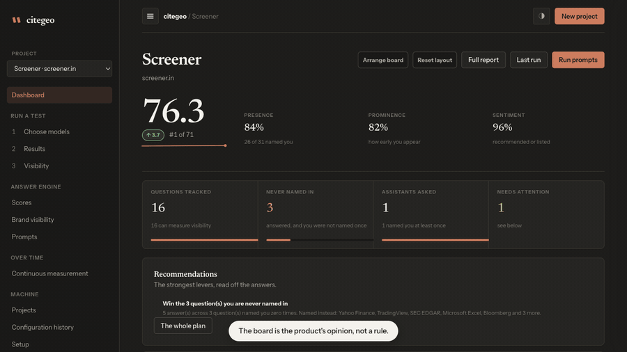

<p align="center">
  <picture>
    <source media="(prefers-color-scheme: dark)" srcset="assets/brand/citegeo-lockup.svg">
    <source media="(prefers-color-scheme: light)" srcset="assets/brand/citegeo-lockup-light.svg">
    
  </picture>
</p>

<p align="center">
  <a href="LICENSE"></a>
  <a href="docs/deployment/docker.md"></a>
</p>

# Open-source GEO and AI visibility tracking

**CiteGEO is a self-hosted generative engine optimization (GEO) and answer
engine optimization (AEO) tool. Point it at a domain. It asks the AI models you
choose the questions your buyers ask, keeps every raw answer, and shows the
receipt behind each number.**

<p align="center">
  <strong>
    <a href="#what-it-looks-like">Screens</a> ·
    <a href="#quick-start">Quick start</a> ·
    <a href="#features">Features</a> ·
    <a href="#how-it-works">How it works</a> ·
    <a href="#faq">FAQ</a> ·
    <a href="#glossary">Glossary</a> ·
    <a href="#docs">Docs</a>
  </strong>
</p>

People now ask an assistant for recommendations instead of searching. If your
product never comes up, or comes up described wrongly, nothing in your analytics
tells you. Search rank tracking cannot see it, because there is no results page
to rank in.

CiteGEO measures it directly. You give it a domain. It queries ChatGPT, Claude,
Gemini, Perplexity and any OpenAI-compatible model you point it at, records what
each one said about your brand, which competitors it named instead, which
sources it cited, and stores the unedited response behind every claim.

> **The one rule.** An absence is reported as an absence, never as a zero.
> Visibility with nothing parsed is `null`, not `0%`. A classifier that failed
> returns `unknown`, not `neutral`. Every figure opens onto the answer it came
> from. A tool whose whole claim is "here is the receipt" cannot round up.

<a id="what-it-looks-like"></a>

## What it looks like

Real screens from a real project, measured through the models, not mockups.

<p align="center">
  
</p>

**Every number opens onto the answer it came from.** A count is a link. Behind
it sits each archived answer, the question that produced it, the model that
wrote it and the sentences themselves.

<p align="center">
  
</p>

The score is never shown alone. Presence, prominence and sentiment sit beside
it with the counts they came from, because a composite with no components is a
number you cannot argue with.

<p align="center">
  
</p>

Share of voice, with the standings beside the chart rather than a colour key to
decode. Brands level on share take the same place. A brand nobody named still
gets a line, along the bottom, because that absence is the finding.

<p align="center">
  
</p>

<p align="center">
  
</p>

**Every topic against every brand the answers named.** The fill is the share, so
a row reads without comparing eight numbers by eye. Open a row for its subtopics
and the questions under them. The verdict on the left is the gap to the best
brand on that row.

<p align="center">
  
</p>

<p align="center">
  
</p>

The board is the product's opinion, not a rule. Drag to reorder, set any panel
to one column, two, or the full row, and take panels off. The arrangement stays
in your browser.

<a id="quick-start"></a>

## Quick start

Node.js 22 or newer, and an API key for at least one provider. OpenRouter is the
easiest start because one key reaches many models.

```bash
git clone https://github.com/ankit373/citegeo.git
cd citegeo
npm ci
cp .env.example .env
```

Put `OPENROUTER_API_KEY` in `.env`, then:

```bash
npm run server
```

Open <http://localhost:8787> and create a project.

Containers are covered in the [Docker guide](docs/deployment/docker.md). With
existing data, read [Backups and upgrades](docs/upgrade.md) first.

You pay your providers directly. CiteGEO adds no cost of its own and sends
nothing anywhere except to the model APIs you configure.

<a id="features"></a>

## Features

### Measurement

| | |
| :--- | :--- |
| **Visibility score** | Presence, prominence and sentiment, always shown next to the composite with the weights that produced it. Never the composite alone. |
| **Share of voice** | Every brand named, across every run, on one axis, with the standings as the legend and the movement in percentage points. |
| **Topics by competitor** | A heatmap of every topic against every brand the answers named, three levels deep: topic, subtopic, and the individual questions. |
| **Brand mentions and sentiment** | How often each brand is named, how early it appears in the answer, and whether it is recommended or merely listed. |
| **Branded and unbranded** | Questions that name your brand are counted apart from those that do not, because presence in the first proves nothing. |
| **By platform, market and persona** | The same figures split by model, by stated market, and by who the question was asked on behalf of. |
| **Prompt volume** | How often anyone actually asked something like each tracked question, from an openly licensed corpus of real conversations, with that corpus's own caveat attached. |

### Evidence

| | |
| :--- | :--- |
| **Every answer archived** | The raw response and the provider payload behind every claim, kept and linked from the figure it produced. |
| **Cited sources** | Provider citations kept separate from URLs that merely appear in answer text. The two are not the same evidence. |
| **Citation gap** | Pages the models cite for your topics that are not yours, which is the list of what to earn. |
| **Query fanout** | The sub-questions a model generated internally, read from the archived provider response across six provider shapes. |
| **Claim audit** | Model disagreement, assertions with no citation behind them, and claims sharing no meaningful word with what the brand declares. |

### Questions and competitors

| | |
| :--- | :--- |
| **Topics and prompts** | The unit of measurement is the question a buyer types, not a keyword. A model proposes a set, a person approves it, and nothing runs unapproved. |
| **Brand-naming prompts excluded** | A prompt that names your brand cannot measure visibility, so it is kept for sentiment and marked as not measuring presence. |
| **Competitors** | Rivals you declare, kept separate from rivals the models happened to name. Adopt the ones named more than once in a click. |
| **Brand marks** | Each brand's own logo, read from the mark its site declares rather than guessed at a conventional path. |

### The board

| | |
| :--- | :--- |
| **Arrangeable dashboard** | Drag to reorder, set each panel to one column, two, or the full row, and take panels off the board. The product's own order is the default. |
| **Deep dive per panel** | Opening a panel gives what the card had to leave out: every row instead of the top few, and the figures a chart is drawn from. |
| **Saved filters** | Topic, model, market and language, with an unset filter drawn differently from a set one. |
| **Light and dark, and a phone** | One theme, system-following with an override, and a layout that works at phone width. |

### Over time

| | |
| :--- | :--- |
| **Scheduled measurement** | Repeat a scope on a cadence through the monitoring worker. Changing your model selection never fabricates history for the new models. |
| **Digests** | Reported only when something moved, with the baseline advancing only on a send that succeeded. |
| **AI crawler analytics** | Which AI crawlers reached your site, from a combined-format access log, with the three states a frequency chart hides: allowed but never arrived, fetched but never cited, and cited but never fetched. |
| **Site signal probe** | Schema, `llms.txt` and robots state on a worker cadence, with stored history and a diff between probes. |
| **Next actions** | A plan built from the stored probe and the real evidence, never from a model's opinion. |

### Providers and plumbing

| | |
| :--- | :--- |
| **Providers** | OpenRouter, OpenAI, Anthropic, Gemini, Perplexity, DeepSeek, Azure OpenAI, and any OpenAI-compatible endpoint including a local gateway. |
| **Web search, stated per model** | Per-model web search with the real execution conditions stored beside the result. Offline and web-enabled answers are never averaged together. |
| **Integrations** | Google Search Console, Google Analytics 4, and GitHub for opening a pull request with the fixes against your own site repository. |
| **Storage** | Disk, anything S3-compatible (AWS, Cloudflare R2, Google Cloud Storage, MinIO, Spaces, Backblaze B2) or Azure Blob. A connection counts as connected only once it has written, read back, listed and deleted a probe object. |
| **Credentials** | Entered in the portal, encrypted at rest, never returned by any read, and refused entirely when the server has no password set. |
| **Exports** | CSV for visibility, share of voice, citations, the gap, fanout and categories. |
| **Optional password** | Off unless `AUTH_PASSWORD` is set. |

<a id="how-it-works"></a>

## How it works

1. **Create a project** for one domain. It is saved before any request is made, so nothing is lost if a run fails.
2. **Pick your models** and decide, per model, whether it may use web search.
3. **Approve a question set.** A model reads a handful of pages a person would open and proposes topics and prompts. You approve them. Nothing runs unapproved.
4. **Run.** Each model answers independently. One model failing does not discard the others.
5. **Read the answers.** Descriptions, named competitors, cited sources and sentiment, each linked to the raw response.
6. **Repeat or schedule it** to build a record you can compare against.

A model recognising a domain you asked it about is not the same as recommending
it unprompted. The interface keeps those apart, because conflating them is the
main way this measurement goes wrong.

<a id="faq"></a>

## FAQ

### What is generative engine optimization (GEO)?

Generative engine optimization is the practice of getting a brand named,
described correctly and cited by AI assistants when they answer a buyer's
question. It replaces the ranking position of search with a different unit: were
you in the answer at all, how early, and on whose authority.

### How is GEO different from SEO?

Search optimization competes for a position on a results page. GEO competes for
a mention inside a generated answer where there is no page and no position. The
inputs overlap, since assistants cite the open web, but the measurement does
not: there is no rank to track, so you have to ask the models and read what
comes back.

### Is answer engine optimization (AEO) the same thing?

Close enough in practice. Answer engine optimization is the older term and is
still the more common one inside marketing teams; generative engine optimization
is now the more searched one. This project treats them as the same work.

### How do you measure AI visibility?

By asking. CiteGEO sends the approved questions to each configured model,
parses the answers for every brand named, and reports presence (how often you
were named), prominence (how early) and sentiment (whether you were recommended
or merely listed). Every figure links to the answers it was computed from.

### Which AI models can it track?

Any model reachable through OpenRouter, the OpenAI, Anthropic, Google Gemini,
Perplexity and DeepSeek APIs, Azure OpenAI, or any OpenAI-compatible endpoint,
including a local gateway. Engines with no API, such as Google AI Overviews, are
on the [roadmap](ROADMAP.md) and blocked on browser automation.

### Does it need my data to leave my machine?

No. It is self-hosted. The only outbound requests are to the model APIs you
configure, the sites it reads to build a brand profile, and any integration you
connect yourself.

### Why does it report "not measurable" instead of a number?

Because a number nobody can check is the thing this tool exists not to print. If
no answer could be parsed, the value is null and says so. Rounding an absence to
zero makes a broken run look like a bad result.

### Can it tell me what to fix?

It produces a plan from the stored probe and the real evidence: the questions
you are never named in, who is named instead, and the pages cited for your
topics that are not yours. It does not ask a model to invent advice.

<a id="glossary"></a>

## Glossary

- **AI visibility**: how often, how early and how favourably an AI assistant names a brand when answering a buyer's question.
- **Visibility score**: a composite of presence, prominence and sentiment, always shown with its three components and their weights.
- **Share of voice**: one brand's share of the answers that named anyone at all.
- **Prominence**: how early in an answer a brand appears, from 0 to 1.
- **Presence**: the share of answers that named the brand at all.
- **Citation gap**: pages the models cite for your topics that you do not own.
- **Query fanout**: the sub-questions a model generates internally from one prompt before answering.
- **Prompt volume**: how often a question like yours was actually asked, counted in an openly licensed corpus of real conversations.
- **Answer engine**: an assistant that answers a question directly instead of returning a list of links.

<a id="docs"></a>

## Documentation

- [How it works](docs/how-it-works.md) · [Architecture](docs/ARCHITECTURE.md)
- [Measurement methodology](docs/measurement-methodology.md) · [Sources and evidence](docs/evidence-model.md)
- [Raising your standing](docs/ranking-process.md) · [Prompt volume](docs/prompt-demand.md)
- [Deployment](docs/deployment/docker.md) · [Backups and upgrades](docs/upgrade.md)
- [Known issues](docs/known-issues.md) · [Limitations](docs/limitations.md)
- [Design system](DESIGN.md) · [Brand](docs/brand.md)
- [Contributing](CONTRIBUTING.md) · [Security policy](SECURITY.md)
- [Roadmap](ROADMAP.md), including what this deliberately will not build
- [Marketing page source](src/site/marketing-page.ts), built to `site/` with `npm run build:site`

## Licence

MIT, see [LICENSE](LICENSE).

Issues and pull requests are welcome at
[github.com/ankit373/citegeo](https://github.com/ankit373/citegeo).

---

CiteGEO reads provider API responses, not consumer chat interfaces, and the two
do not always agree. Offline and web-enabled results mean different things and
should be read separately. This is not search-engine rank tracking.
