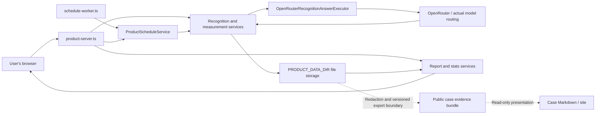
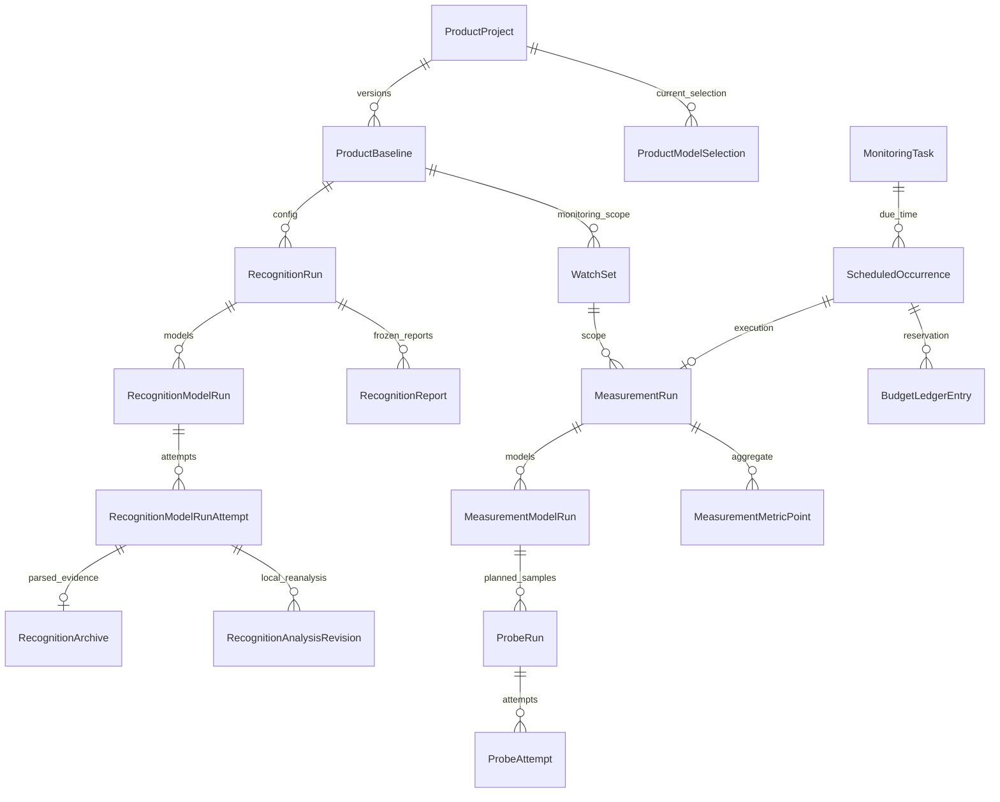
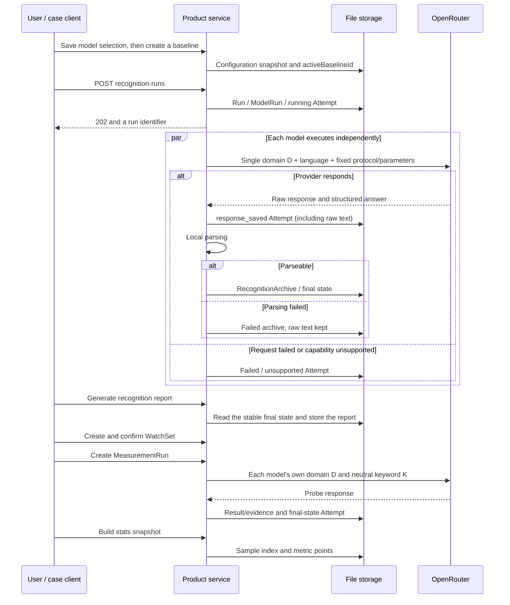

# Current product architecture

Audience: `src/product` in the Phase 6 worktree; planned release version **v0.2.0-rc.1, UNPUBLISHED**. This page documents the source code; it is not a release, container-run, or real-model acceptance report. The checkpoint commit is `18c41528a1a7cee8562a6ddc10e59021487962e6`, but the current product includes uncommitted changes, so that HEAD alone cannot rebuild the product described on this page.

This continues to be the repository's one `docs/ARCHITECTURE.md`; no differently-cased duplicate entry point is created. The earlier AuditPlan architecture is preserved as-is at legacy architecture. The old design draft, the old CLI, and the current product can coexist; to judge current capability, start from the service entry points and source code linked on this page.

## System boundary

CiteGEO records a provider API's answer and its evidence. The current product executor only goes through OpenRouter; other provider adapters exist in the repository, but that does not mean the new product interface exposes a direct entry point for them.

What is published is this run's answer and its evidence; it does not expose the model's internal reasoning, and a rerun is not guaranteed to produce an identical answer.



The solid lines are the current product's actual dependencies. The dashed lines mark the Phase 6 public delivery boundary; they are not an export HTTP API built into the product service. The case client, the isolated product session, and the public export reuse the existing services. The case executor injects a cumulative-budget wrapper inside an isolated `PRODUCT_DATA_DIR`; the site and Markdown reads go through the public export. A freshly installed workbench never auto-imports the public cases. R02 has this round's actual D/K answers, three measurements, and parsing failures recorded. All 20 cases in the study plan have run to their final state; a run finishing does not mean every answer is valid — coverage and failures are in each case's evidence index.

## Entry points and responsibilities

| Module | Actual responsibility and source |
| --- | --- |
| HTTP service | [product-server.ts](../src/product/product-server.ts): Node HTTP, dependency wiring, pages and static assets, route dispatch |
| Projects | [project-service.ts](../src/product/projects/project-service.ts): domain normalization, duplicate-domain constraint, project archive/soft-delete/restore/purge |
| Configuration | [baseline-service.ts](../src/product/configuration/baseline-service.ts), [model-selection-service.ts](../src/product/configuration/model-selection-service.ts): model selection and immutable configuration snapshots |
| Domain recognition | [recognition-service.ts](../src/product/recognition/recognition-service.ts): D requests, attempts, response archiving, parsing, retries, and local re-analysis |
| Recognition report | [report-service.ts](../src/product/reports/report-service.ts): fixed-source snapshot for a completed recognition run, field-evidence integrity, competitor and keyword grouping |
| Scope to watch | [watchset-service.ts](../src/product/measurements/watchset-service.ts): proposes objects/keywords from a stored report, generates and confirms WatchSet versions |
| Continuous measurement | [measurement-service.ts](../src/product/measurements/measurement-service.ts): D/K probe planning, execution, and per-probe retries |
| Statistics | [measurement-stats.ts](../src/product/measurements/measurement-stats.ts): generates metric points and sample indices per model/object/keyword/run, without calling a model |
| Scheduling | [schedule-service.ts](../src/product/scheduling/schedule-service.ts), [schedule-worker.ts](../src/product/scheduling/schedule-worker.ts): cron computation, due-record detection, task locking, measurement dispatch, and final-state reconciliation |
| Interface | [product-phase4-app.ts](../src/ui/product-phase4-app.ts) for recognition/reports; [product-phase5-app.ts](../src/ui/product-phase5-app.ts) for measurement/charts/tasks |

The default page is `/`, and continuous measurement is `/?view=measurements`. There is currently no arbitrary-path SPA fallback; do not treat a guessed address like `/projects/...` as a working deep link. How other query parameters are read is governed by the matching interface code.

## Data relationships



`WatchSet` embeds `WatchObject[]`, `WatchKeyword[]`, and a D/K protocol snapshot; `MeasurementStatsSnapshot` embeds metric points. The containment relationships in this entity diagram do not represent database foreign keys or cross-file transactions.

A configuration snapshot stores the normalized domain, model routing/display name/search capability, language, protocol, analysis version, and `configHash`. Changing the model selection never directly edits an existing baseline; after creating a new baseline, its WatchSet must be confirmed separately. Creating a baseline when the same configuration hash already exists returns a conflict, not an automatic re-activation of the historical baseline.

## Two execution paths



The recognition service stores the full response first, then parses it. The measurement service currently writes probe evidence/parse results first, and writes the final-state Attempt with its raw response last, so there is a window during a process interruption where the raw text has not yet been persisted. These two paths cannot be summarized as "every response is always archived first."

D sends only the normalized domain; it never sends the project's brand name, aliases, competitors, site-crawl content, or other model output. K sends only a keyword, a language, and the fixed neutral protocol; the monitored objects are used for local exact-matching after the response comes back. See [how it works](how-it-works.md) and [measurement methodology](measurement-methodology.md) for more input and sampling rules.

## Storage and mutability

Data root directory priority, from [env.ts](../src/config/env.ts):

```text
PRODUCT_DATA_DIR
  otherwise MONITORING_DATA_DIR/product-v2
  otherwise data/product-v2 (relative to the process working directory)
```

Main structure of the full data root directory:

```text
product-v2/
  locks/<domain-hash>.lock
  projects/<projectId>/
    project.json
    model-selections.json
    baselines/<baselineId>.json
    recognition-runs/<runId>/
      run.json
      reports/<reportId>.json
      model-runs/<modelRunId>/
        model-run.json
        attempts/<attemptId>.json
        recognition-archives/<attemptId>.json
        analysis-revisions/<attemptId>/<revisionId>.json
    measurements/
      watch-sets/<watchSetId>.json
      runs/<runId>/
        run.json
        model-runs/<modelRunId>/
          model-run.json
          probe-runs/<probeId>.json
          attempts/<probeId>/<attemptId>.json
          results/<probeId>.json
          evidence/<probeId>.json
      stats/<snapshotId>.json
    schedules/
      tasks/<taskId>.json
      occurrences/<task-and-time-hash>.json
      ledger/<entryId>.json
      locks/<task-hash>.lock
```

Sources: [project store](../src/product/projects/project-store.ts), [configuration store](../src/product/configuration/configuration-store.ts), [recognition store](../src/product/recognition/recognition-store.ts), [measurement store](../src/product/measurements/measurement-store.ts), [schedule store](../src/product/scheduling/schedule-store.ts).

A JSON write generally uses a temp file plus rename, which guarantees a single-file replace; it is not a cross-file transaction, a database log, or tamper-evident storage. The project, model selection, run status, task, occurrence, and ledger are all updated in place. A baseline's business content is stored as a new version; a WatchSet's active/retired status is updated in place. A retry appends an Attempt; a recognition analysis revision is stored separately. A measurement's `results/<probeId>.json` and `evidence/<probeId>.json`, however, are overwritten by a retry, so it cannot be claimed that every per-attempt derived piece of evidence is immutable. A backup must cover the entire data root directory.

## Markdown case export

The regular product UI, execution API, reports, and charts are unaffected. Reading a case does not go through the product API and requires no second service to start.

The plan, validate, replay, and export commands in examples/cli.mjs read or recheck existing archives; export.mjs writes records, field locations, and source groupings out as redacted evidence and Markdown. The documentation generator only reads existing public evidence, the original ledger, and the semantic audit; it assembles the four demo sets, the 20 case pages, and the question index, without calling the executor or updating the original run/attempt.

`examples/cases/R01..R20/README*.md` are the sole delivery location for a case's body text; `public-evidence.json`, `evidence-index.json`, and the original images provide the evidence via relative links. `website/` is a retained historical static-preview source, not a required component; see the archive note. Inference only happens if the user separately opts into a live run.

## Actual HTTP API

Verified against each `*-http.ts` file below. Notation: `P=/api/projects/:projectId`, `R=P/recognition-runs/:runId`, `M=P/measurement-runs/:runId`. This is route notation; substitute the actual identifiers when copying a request.

| Method and path | Purpose / side effect |
| --- | --- |
| `GET /health` | Returns only that the service is alive; does not check disk, keys, routes, or models |
| `GET /assets/...` | Serves static files from `assets` under the working directory |
| `GET /api/provider-models` | Queries the OpenRouter model catalog, which may reach the public internet; sends no inference |
| `GET/POST /api/projects` | List/create a draft; the list accepts `includeArchived`, `includeDeleted` |
| `GET/PATCH/DELETE P` | Read/edit/soft-delete; `GET` accepts `includeDeleted` |
| `POST P/archive`, `POST P/restore`, `DELETE P/purge` | Archive, restore, or permanently purge a deleted project |
| `GET/PUT P/models` | Model selection; the `PUT` body's `selections` carry `modelId`, `webSearchMode` |
| `GET P/monitoring-configuration` | Current configuration status |
| `GET/POST P/baselines`, `GET P/baselines/:baselineId` | List, create, or read configuration versions |
| `GET/POST P/recognition-runs`, `GET R` | List/paid-execute/read recognition; `POST` accepts an optional `modelIds`, with an idempotency key from the `Idempotency-Key` header |
| `GET R/model-runs/:modelRunId` | Model status, every attempt, archive, and local analysis revisions |
| `GET R/model-runs/:modelRunId/attempts/:attemptId` | One recognition attempt and its archive |
| `POST R/model-runs/:modelRunId/retry` | Re-request, which may incur a cost |
| `POST R/model-runs/:modelRunId/attempts/:attemptId/reanalyze` | Re-parse a saved answer locally, without calling a model |
| `GET/POST R/reports`, `GET R/reports/:reportId` | List/generate locally/read a fixed report |
| `GET R/reports/:reportId/model-runs/:modelRunId` | A model's observation inside a fixed report |
| `GET P/watch-sets/suggestion` | Propose a scope from an existing report |
| `GET/POST P/watch-sets`, `GET P/watch-sets/:watchSetId` | List/generate a draft/read; `POST` may pass `objectIds`, `keywordIds`, `repetitions` |
| `POST P/watch-sets/:watchSetId/confirm` | Activate a scope and retire the previous one |
| `GET/POST P/measurement-runs`, `GET M` | List/paid-execute/read measurements; `POST`'s `modelIds`, `idempotencyKey`, and `budget` are in the JSON body |
| `POST P/measurement-runs/new-models` | Request only selected models that never appeared in the historical `modelScope` |
| `GET M/model-runs/:modelRunId/probes/:probeId` | A probe, its attempts, results, and citations |
| `POST M/model-runs/:modelRunId/probes/:probeId/retry` | Re-request a failed/unsupported/budget-blocked probe, which may incur a cost |
| `POST P/measurement-stats`, `GET P/measurement-stats/:snapshotId` | Build/read a stats snapshot locally |
| `GET P/measurement-stats/:snapshotId/points/:pointId/samples` | Drill into a point's numerator, denominator, and excluded samples |
| `GET/POST P/monitoring-tasks`, `GET/PATCH/DELETE P/monitoring-tasks/:taskId` | Manage a scheduled task; it is active as soon as it is created |
| `POST P/monitoring-tasks/preview` | Preview the next three occurrence times using the request body's rule, without executing |
| `POST P/monitoring-tasks/:taskId/pause` or `resume` | Pause/resume future execution |
| `GET P/monitoring-tasks/:taskId/preview` or `occurrences` | Preview upcoming times / historical due-records |
| `POST /api/scheduler/due` | Scan every project for due tasks, which may trigger paid calls |

Project routes complete their scope check before the fallback handler; each store rechecks the parent ID it stored, and the project ID also goes through a path-segment check. This is a local project-organization boundary; **it is not user authentication, authorization, or tenant-level security isolation.** The current product service has no login, no access control, and no built-in TLS; it must not be run directly as a public multi-user service. Deeper ID and filesystem access should also not be treated as having passed a security audit.

## Reports, charts, and versioning

A recognition report reads each ModelRun's `currentAttemptId` and the raw archive from that same attempt; it stores `sourceAttemptMap`, the source-record hash, and the protocol/configuration/report versions. It is generated once two consecutive reads see the same source state, trying at most three read cycles. Reading a report never re-runs inference, and it never automatically adopts the latest local re-analysis revision. This differs from the recognition detail page, which prefers to show the latest AnalysisRevision.

Measurement stats reads every existing measurement run; it does not delete partial/failed runs first, and each metric chooses its own denominator. A metric point carries its samples and any exclusion reasons. The interface groups by model, search configuration, and probe fingerprint, using the run's start time rather than the report's generation time or the screenshot's capture time. See [measurement methodology](measurement-methodology.md) and [limitations](limitations.md) for the actual gaps around first-sample strategy, caching, disconnects, and scope changes; do not apply the old workbench's "last complete run of the day" rule to this page.

## Scheduling and concurrency

By default, the worker calls `runDue()` every 60 seconds; a positional argument can set the polling interval in seconds, with a minimum of 10. The HTTP service itself has no automatic timer loop. Dates are computed by `cron-parser` against a task's timezone, supporting daily, weekly, monthly, and custom.

Scheduling first serializes a single task with a file lock, then establishes a unique occurrence keyed by task ID and the planned UTC time, then calls the same measurement service. A started occurrence reads the run's final state on a later scan and reconciles against it; an occurrence marked `completed` can still correspond to a partial/failed run, so check both the reason and the run status.

Currently the lock and the unique file provide only partial duplicate protection; an exactly-once execution after a crash is not guaranteed. A run is not a persistent queue, and an old lock has no lease-based recovery; a skipped or budget-blocked branch does not advance `nextRunAt`, and handling of a missed time has not fully implemented skip semantics. A task stores `watchSetId`, but at execution time the measurement service reads the current scope, and a task-scope consistency check is still missing. See [limitations](limitations.md) for detailed risks and cost limits.

## Archive, delete, and legacy

The default project list does not show archived/deleted projects; the data still lives in its original project directory. Restore rechecks for a domain conflict; purge is only allowed on an already-soft-deleted project and permanently removes the entire project directory. Starting a run does not fully check for a disabling archived state, and deleting does not cancel a request already executing in memory; the task must be stopped first and any in-flight request allowed to finish.

The current product never auto-reads the old `runs/` or `data/projects/`, and it does not mount the old AuditPlan API. The old `src/server.ts` and its related `src/cli.ts` commands are not a substitute for the entry points on this page. There is no accepted automatic legacy migration tool; the original data is retained, handled per [upgrade and rollback](upgrade.md). The container entry point, resources, and volumes are governed by [Docker deployment](deployment/docker.md).
